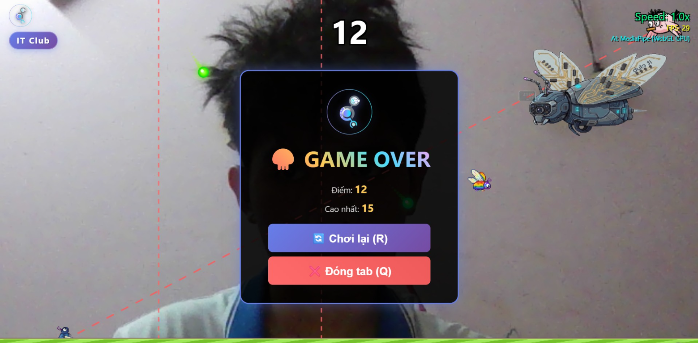

<div align="center">

# 🐛 FLAPPY PUSHUPS

### _Điều khiển game bằng khuôn mặt - Không cần bàn phím!_

[](https://ctu-itclub.github.io/flappy-pushups-web/)
[](https://github.com/ctu-itclub)
[](https://github.com/ctu-itclub)



**🎯 Bạn nghĩ Flappy Bird khó? Thử điều khiển bằng MẶT xem!**

[🎮 Chơi Ngay](https://ctu-itclub.github.io/flappy-pushups-web/) • [📖 Hướng Dẫn](#-cách-chơi) • [🛠️ Cài Đặt](#-chạy-local)

</div>

---

## 🔥 Tại sao game này đặc biệt?

> _"Quên bàn phím đi. Quên chuột đi. Chỉ cần khuôn mặt của bạn."_

**Flappy Pushups** biến webcam của bạn thành controller! Sử dụng AI nhận diện khuôn mặt, game theo dõi chuyển động đầu của bạn để điều khiển nhân vật - hoàn toàn KHÔNG cần chạm vào bàn phím.

### ✨ Điểm nổi bật

| 🎯 Feature            | 📝 Mô tả                                         |
| --------------------- | ------------------------------------------------ |
| 📹 **Face Control**   | AI MediaPipe theo dõi 468 điểm trên khuôn mặt    |
| 🧠 **100% Local**     | AI chạy trên máy bạn - không gửi dữ liệu đi đâu! |
| 👹 **Boss Battle**    | Trận chiến epic với bom và laser tại level 12    |
| 🦟 **Kẻ thù đa dạng** | LGBT Bird, Pink Bird với AI hành vi riêng        |
| 📱 **Responsive**     | Chơi được trên mọi màn hình                      |
| 🎵 **Nhạc nền**       | Nhạc sôi động làm game thêm hấp dẫn              |

---

## 🎮 Cách chơi

```
     🙂 Ngẩng lên     → Bug bay LÊN
     😔 Cúi xuống     → Bug bay XUỐNG
     😏 Nghiêng trái  → Bug bay TRÁI
     😌 Nghiêng phải  → Bug bay PHẢI
```

### Mục tiêu

1. 🚫 **Né** các ống nước (pipes)
2. ⚡ **Tránh** kẻ thù và đạn
3. 👹 **Đánh bại** Boss ở điểm 12 để chiến thắng!

### Kẻ thù xuất hiện

- **Điểm 2+**: 🦟 LGBT Bird (lao thẳng/bắn đạn)
- **Điểm 4+**: 🐦 Pink Bird (bay chéo nguy hiểm)
- **Điểm 12**: 👹 **BOSS BATTLE** - 10 bom + 10 laser + combo cuối!

---

## 🚀 Chơi Online

### 👉 [**CLICK ĐÂY ĐỂ CHƠI NGAY!**](https://ctu-itclub.github.io/flappy-pushups-web/) 👈

_Không cần cài đặt. Không cần download. Chỉ cần webcam và trình duyệt!_

---

## 💻 Chạy Local

<details>
<summary><b>📌 Click để xem hướng dẫn</b></summary>

### Yêu cầu

- Trình duyệt hiện đại (Chrome/Edge/Firefox)
- Webcam
- Cho phép quyền truy cập camera

### Cách 1: Python

```bash
git clone https://github.com/ctu-itclub/flappy-pushups-web.git
cd flappy-pushups-web
python -m http.server 8080
# Mở http://localhost:8080
```

### Cách 2: VS Code Live Server

1. Cài extension "Live Server"
2. Right-click `index.html` → "Open with Live Server"

### Cách 3: Node.js

```bash
npx http-server
```

</details>

---

## 🛠️ Tech Stack

<div align="center">

| Technology                                                                                               | Purpose                             |
| -------------------------------------------------------------------------------------------------------- | ----------------------------------- |
|                 | Game canvas & structure             |
|                    | Modern UI styling                   |
|  | Game logic (vanilla, no framework!) |
|        | AI Face Detection (468 landmarks)   |

</div>

---

## 📁 Cấu trúc Project

```
flappy-pushups/
├── 🎨 assets/          # Sprites & images
├── 🎭 css/style.css    # Game styling
├── ⚙️ js/
│   ├── game.js         # Main controller
│   ├── faceDetection.js# MediaPipe AI
│   ├── bird.js         # Player character
│   ├── boss.js         # Boss battle system
│   ├── enemy.js        # LGBT enemy AI
│   ├── pinkEnemy.js    # Pink bird AI
│   ├── bullet.js       # Projectile system
│   └── pipe.js         # Obstacles
├── 🎵 nhac_nen.mp3     # Background music
├── 📄 index.html       # Entry point
└── 📖 README.md
```

---

## 👥 Credits

<div align="center">

### 🎓 **CTU IT Club**

_Game được phát triển bởi IT Club - Đại học Cần Thơ_

Dự án giáo dục nhằm giới thiệu công nghệ AI/ML và lập trình game cho sinh viên.

---

**⭐ Star repo này nếu bạn thấy hay!**

[](https://github.com/ctu-itclub/flappy-pushups-web)

</div>

---

<div align="center">

### 🎮 Ready to play?

[](https://ctu-itclub.github.io/flappy-pushups-web/)

_Tip: Boss đang chờ bạn ở điểm 12... Bạn có đủ can đảm?_ 👹

</div>
